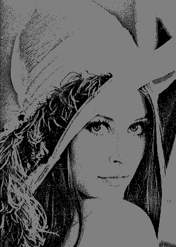
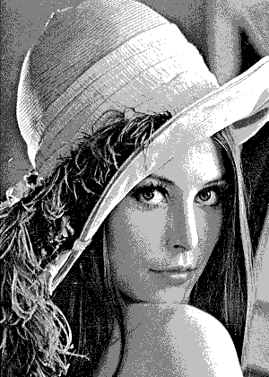
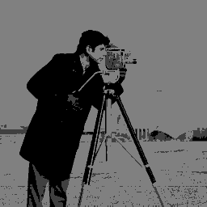
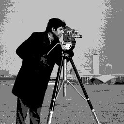
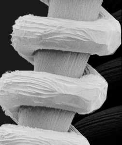
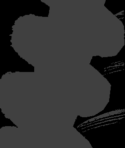
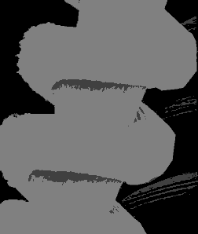
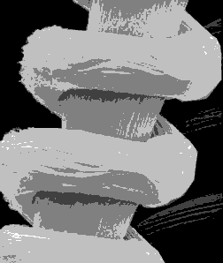

# Assignment 11 Q-3 (Error diffusion)

## Overview

Implementation of an m-level error diffusion dithering on grayscale images.

### Error Diffusion Implementation in the Code

The main error diffusion logic is implemented in the `error_diffusion` function:

```python
def error_diffusion(image, m):
    levels = np.array([0, 64, 128, 192, 255])[:m]
    height, width = image.shape
    output = np.zeros_like(image, dtype=float)

    for y in range(height):
        for x in range(width):
            old_pixel = image[y, x]
            new_pixel = quantize(old_pixel, levels)
            output[y, x] = new_pixel
            error = old_pixel - new_pixel

            if x + 1 < width:
                output[y, x + 1] += error * 7 / 16
            if y + 1 < height:
                if x > 0:
                    output[y + 1, x - 1] += error * 3 / 16
                output[y + 1, x] += error * 5 / 16
                if x + 1 < width:
                    output[y + 1, x + 1] += error * 1 / 16

    return output.astype(np.uint8)
```

## Input-Output Examples

Here are some examples of the error diffusion dithering process applied to different images with varying numbers of gray levels.

### 1. Lena

#### Original Image:


#### Dithered Images:

| 2 Levels | 3 Levels | 4 Levels | 5 Levels |
|----------|----------|----------|----------|
|  |  |  |  |

### 2. Cameraman

#### Original Image:


#### Dithered Images:

| 2 Levels | 3 Levels | 4 Levels | 5 Levels |
|----------|----------|----------|----------|
|  |  |  |  |

### 3. Tungsten

#### Original Image:



#### Dithered Images:

| 2 Levels | 3 Levels | 4 Levels | 5 Levels |
|----------|----------|----------|----------|
|  |  |  |  |


