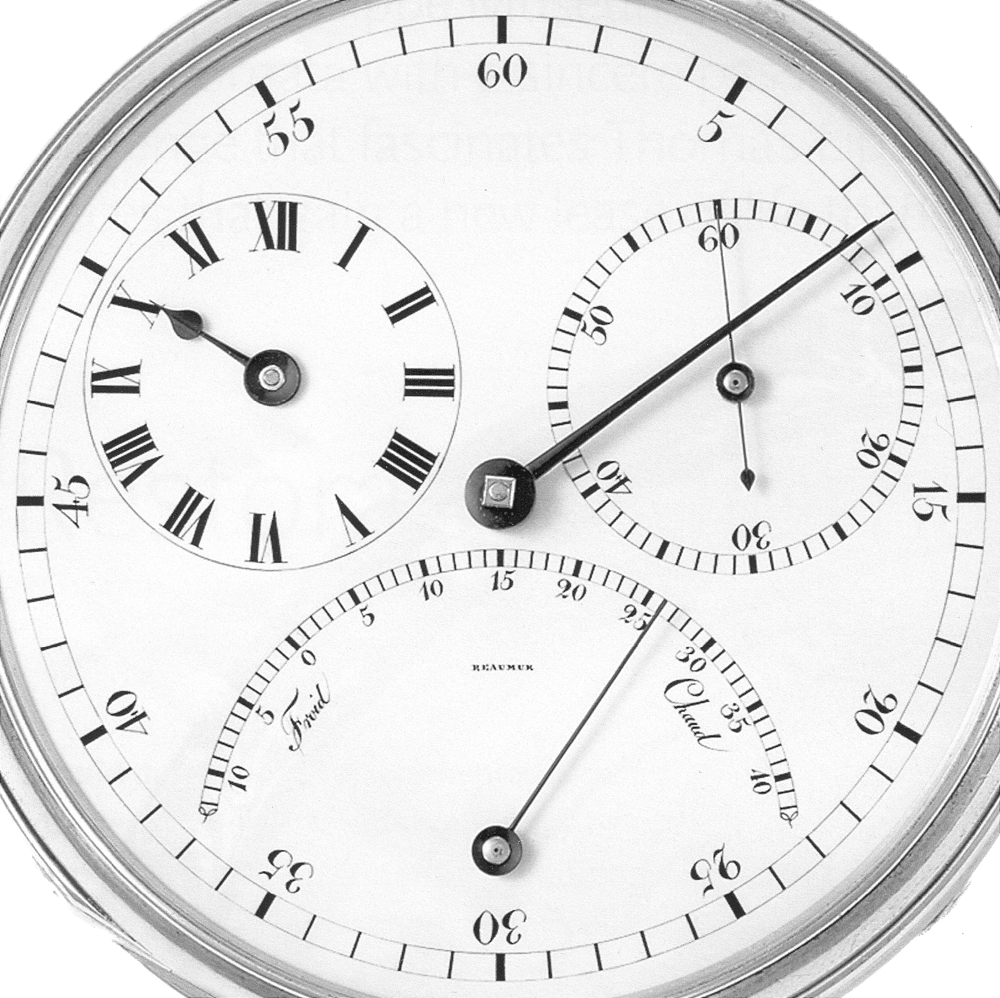
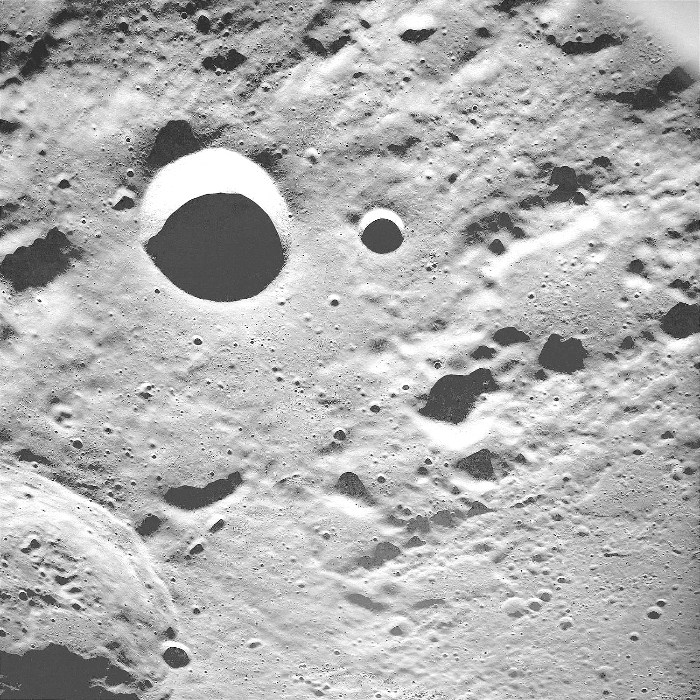
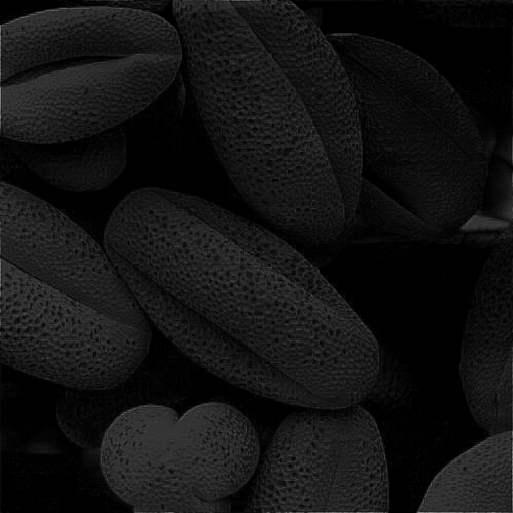

# Assignment 12 Q1 - Laplacian Filter Image Sharpening

## Input-Output Examples

The program processes images placed in the `input` directory. For each image, it generates several outputs in the `output` directory:

1. Original Image
2. Fourier Transform Magnitude
3. Laplacian Filter
4. Laplacian-Filtered Image
5. Enhanced Image

### Example: Processing "blurry-moon.tif"

Input: input/blurry-moon.tif (original grayscale image)

Outputs:
- output/blurry-moon_Original_Image.png
- output/blurry-moon_Fourier_Transform_Magnitude.png
- output/blurry-moon_Laplacian_Filter.png
- output/blurry-moon_Laplacian_Filtered_Image.png
- output/blurry-moon_Enhanced_Image.png

As the Laplacian filter is applied, you'll see the emphasis on edges and fine details in the image. The final enhanced image will show improved sharpness and detail compared to the original.

## Functions

### In `src/laplacian_frequency_filter.py`:

- `load_and_normalize_image(image_path)`: Loads and normalizes an image to the range [0, 1].
- `fourier_transform(image)`: Computes the 2D Fourier Transform of the image.
- `create_laplacian_filter(shape)`: Creates a Laplacian filter in the frequency domain.
- `apply_laplacian_filter(ft_image, laplacian_filter)`: Applies the Laplacian filter to the Fourier Transform of the image.
- `enhance_image(original, laplacian)`: Combines the original image with the Laplacian-filtered image for enhancement.
- `laplacian_filter_workflow(image_path, save_to_dir)`: Orchestrates the entire Laplacian filtering process for a single image.

### In `src/main.py`:

- `process_images(image_directory, save_output)`: Processes all images in the specified directory using the Laplacian filter workflow.

## Usage

1. Ensure your input images are in the `input` directory.
2. Run `src/main.py`:
   ```
   python src/main.py
   ```
3. The program will process all supported image files (`.tif` in this case) in the `input` directory.
4. Processed images will be displayed and saved in the `output` directory.

## Examples

Here are some examples of the Laplacian filter process applied to different images.

### 1. Blurry Moon

#### Original Image:


#### Enhanced Image:


### 2. Chronometer

#### Original Image:


#### Enhanced Image:


### 3. Lunar Shadows

#### Original Image:


#### Enhanced Image:


### 4. Magnified Pollen (Dark)

#### Original Image:


#### Enhanced Image:



