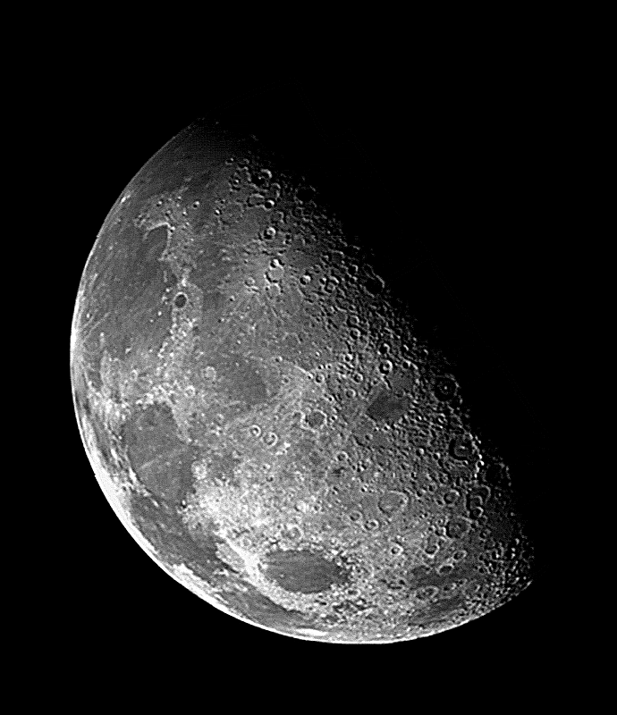

# Laplacian Filter Image Sharpening

## Overview

This program implements a Laplacian filter for image sharpening using frequency domain processing. It applies a Laplacian filter to grayscale images in the frequency domain, resulting in sharpened images with enhanced edges and details. The program processes multiple images and provides visualization of intermediate steps.

## Laplacian Filter in Frequency Domain

The Laplacian filter is a second-order derivative filter used for edge detection and image sharpening. In the frequency domain, it emphasizes high-frequency components, which correspond to edges and fine details in the image.

### How the Laplacian Filter Works

1. Convert the image to the frequency domain using the Fourier Transform.
2. Apply the Laplacian filter in the frequency domain.
3. Convert the filtered image back to the spatial domain using the Inverse Fourier Transform.
4. Combine the filtered image with the original to enhance edges and details.

### Implementation in the Code

The main Laplacian filter logic is implemented in several functions in `src/laplacian_frequency_filter.py`:

```python
def fourier_transform(image):
    # Compute 2D Fourier Transform
    ft = np.fft.fft2(image)
    # Shift the zero-frequency component to the center of the spectrum
    return np.fft.fftshift(ft)

def create_laplacian_filter(shape):
    P, Q = shape
    H = np.zeros((P, Q), dtype=np.float32)
    for u in range(P):
        for v in range(Q):
            # Compute the Laplacian filter value for each frequency
            H[u,v] = -4 * np.pi**2 * ((u - P/2)**2 + (v - Q/2)**2)
    return H

def apply_laplacian_filter(ft_image, laplacian_filter):
    # Apply the filter in the frequency domain
    Lap = laplacian_filter * ft_image
    # Shift back the zero-frequency component
    Lap = np.fft.ifftshift(Lap)
    # Perform inverse Fourier Transform and take the real part
    return np.real(np.fft.ifft2(Lap))
```

## Input-Output Examples

The program processes images placed in the `input` directory. For each image, it generates several outputs in the `output` directory:

1. Original Image
2. Fourier Transform Magnitude
3. Laplacian Filter
4. Laplacian-Filtered Image
5. Enhanced Image

### Example: Processing "blurry-moon.tif"

Input: input/blurry-moon.tif (original grayscale image)

Outputs:
- output/blurry-moon_Original_Image.png
- output/blurry-moon_Fourier_Transform_Magnitude.png
- output/blurry-moon_Laplacian_Filter.png
- output/blurry-moon_Laplacian_Filtered_Image.png
- output/blurry-moon_Enhanced_Image.png

As the Laplacian filter is applied, you'll see the emphasis on edges and fine details in the image. The final enhanced image will show improved sharpness and detail compared to the original.

## Functions

### In `src/laplacian_frequency_filter.py`:

- `load_and_normalize_image(image_path)`: Loads and normalizes an image to the range [0, 1].
- `fourier_transform(image)`: Computes the 2D Fourier Transform of the image.
- `create_laplacian_filter(shape)`: Creates a Laplacian filter in the frequency domain.
- `apply_laplacian_filter(ft_image, laplacian_filter)`: Applies the Laplacian filter to the Fourier Transform of the image.
- `enhance_image(original, laplacian)`: Combines the original image with the Laplacian-filtered image for enhancement.
- `laplacian_filter_workflow(image_path, save_to_dir)`: Orchestrates the entire Laplacian filtering process for a single image.

### In `src/main.py`:

- `process_images(image_directory, save_output)`: Processes all images in the specified directory using the Laplacian filter workflow.

## Features

- Laplacian filtering in the frequency domain
- Visualization of intermediate steps (Fourier Transform, Laplacian Filter)
- Side-by-side display of original and enhanced images
- Automatic saving of all intermediate and final outputs
- Batch processing of multiple images

## Usage

1. Ensure your input images are in the `input` directory.
2. Run `src/main.py`:
   ```
   python src/main.py
   ```
3. The program will process all supported image files (`.tif` in this case) in the `input` directory.
4. Processed images will be displayed and saved in the `output` directory.

## Examples

Here are some examples of the Laplacian filter process applied to different images.

### 1. Blurry Moon

#### Original Image:


#### Enhanced Image:


### 2. Chronometer

#### Original Image:


#### Enhanced Image:


### 3. Lunar Shadows

#### Original Image:


#### Enhanced Image:


### 4. Magnified Pollen (Dark)

#### Original Image:


#### Enhanced Image:


As you can see from these examples:

1. The Laplacian filter enhances edges and fine details in the images.
2. The enhanced images show improved contrast and sharpness compared to the originals.
3. The technique is particularly effective at bringing out textures and subtle features in the images.
4. It works well on various types of images, from astronomical objects to microscopic structures.

